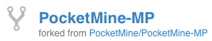

.. _git:

How to use git
==============

Clone PocketMine-MP
-------------------
Get the clone URL from `PocketMine/PocketMine-MP <https://github.com/PocketMine/PocketMine-MP>`_

.. code-block:: sh

	$ git clone git@github.com:PocketMine/PocketMine-MP.git PocketMine-MP.git  # clone the original repository into PocketMine-MP.git
	$ cd PocketMine-MP.git  # change directory to PocketMine-MP.git

How to make a pull request
--------------------------
Go to the `PocketMine/PocketMine-MP <https://github.com/PocketMine/PocketMine-MP>`_ repository and hit the **Fork** button. You should now have a forked repo from **PocketMine/PocketMine-MP** in your own repositories.

Get the clone URL from the fork and clone it into another directory:

.. code-block:: sh

	$ git clone git clone <YOUR SSH/HTTPS clone URL> PocketMine-MP-Fork.git  # clone the original repository into PocketMine-MP-Fork.git
	$ git checkout -b feature  # create and switch to branch feature (it can be any name)
	$ git branch # shows current branch
	* feature  # current branch
	  master

Make your changes to the code and commit it:

.. note::
	Only commit changes described in the commit message

.. code-block:: sh
	
	$ git status  # check the status
	$ git add <filename>  # add all changed files
	$ git commit -m 'description of changes'  # make a commit with a message
	$ git push origin feature  # push to your branch

Take a look at GitHub and make a pull request. If the pull request is accepted and merged you can pull the changes back into your fork.

.. note::
	To pull from the original repository you need to add the upstream
	``$ git remote add upstream git@github.com:PocketMine/PocketMine-MP.git``

.. code-block:: sh
	
	$ git checkout master  # switch back to the master branch
	$ git fetch upstream  # download latest commits from the upstream
	$ git merge upstream/master  # merge changes from upstream/master into your master branch

Remove the branch you made with

.. code-block:: sh
	
	$ git branch -d feature  # remove the branch to keep it clean

