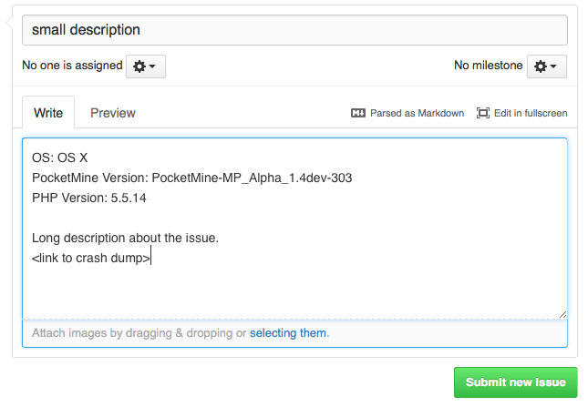

.. _issues:

Issues
======

Check the following things and update if needed before making a new issue:

* PocketMine-MP version
* PHP binary version
* Plugin versions

When you have the latest version of those files and the problem still occures and you are sure a **plugin** is not the cause then `make an new issue <https://github.com/PocketMine/PocketMine-MP/issues/new>`_ on GitHub.

Give as much information as you can about when or what happened.

.. warning::
	Did the server crash and generated it a crash dump? Post it on `pastie <http://pastie.org>`_ or `pastebin <http://pastebin.com>`_ and provide a link to it in your issue.

